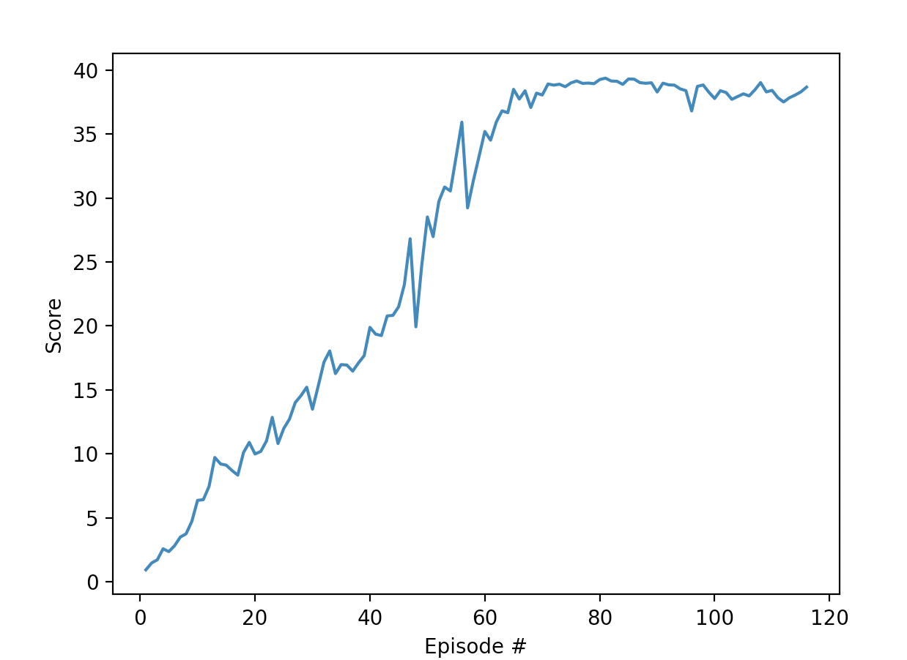

### Algorithm
We use DDPG to solve this environment with:

Actor:
* Hidden layer of 128
* BatchNorm1d layer to stablize the model
* Hidden layer of 256
* Relu non-linear layers
* tanh output layer to constrain the output between -1 and 1

Critic:
* Hidden layer of 128
* BatchNorm1d layer to stablize the model
* Hidden layer of 256
* Relu non-linear layers
*No non-linearity on the output of the last layer
 
Hyperparameters:
* number of episodes = 1000 (never reached)
* max timesteps per episode = 1000
* seed = 2
* weight decay = 0
* learning rate for critic = 1e-3
* learning rate for actor = 1e-4
* tau = 1e-3
* gamma = .99
* batch size = 128
* buffer size = 1e6
* update every 20 timesteps
* update 10 times every time we do an update
* theta (noise) = .15
* sigma (nooise) = .2
* mu (noise) = 0.0s

### Plot of Rewards
We can see the agent getting better over time with the following plot:

We can see that oour agent quickly surpasses the threshold of 30 and terminates after just 115 episodes with an average score of 30.26 over the proceeding 100 episodes.

### Ideas for Future Work

While the robotic arm provides a place to experiment with DDPG, it lacks a direct application to the real world.  Solving the Crawler at https://github.com/Unity-Technologies/ml-agents/blob/master/docs/Learning-Environment-Examples.md#crawler would reflect a more realistic use case of the DDPG algorithm.

Alternatively, this would also be a good place to test out a number of Reinforcement algorithms like REINFORCE and see how they compare.